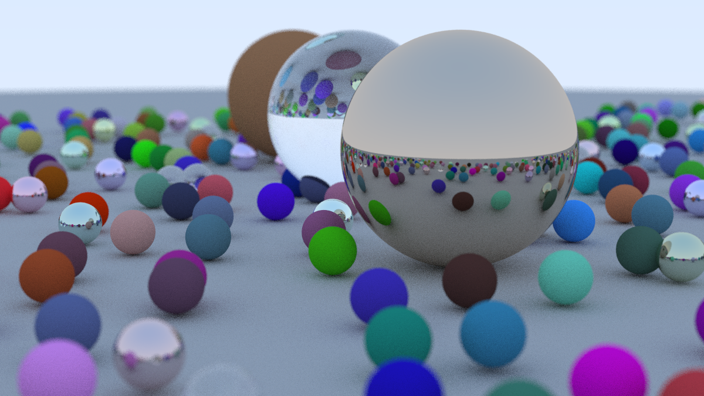

# CPU-Optimized Ray Tracer

A high-performance CPU ray tracing renderer in C++ that generates 3D scenes from scratch with parallel execution and measurable optimizations.

---

## Overview

This repository contains a software ray tracer built from first principles in C++. It implements basic ray tracing features and emphasizes **performance engineering**, including multithreading and contention reduction techniques.

Unlike simple tutorial code, this project includes profiling-driven enhancements that dramatically improve rendering times on multicore systems.

---

## Features

- Ray-sphere intersection
- Diffuse (Lambertian) and metal materials
- Antialiasing with multiple samples per pixel
- Gamma correction
- Random scene generation
- Outputs `.ppm` images
- **Parallel rendering with multithreading**
- **Thread-local random number generation to reduce contention**

---

## Example Output



---

## Performance Results

Measured rendering times for the same scene:

| Configuration | Time |
|---------------|------|
| Single-threaded | **666s** |
| Multithreaded (10 threads) | **233s** |
| Multithreaded + thread-local RNG (10 threads) | **157s** (~4.2× speedup) |

The optimization reduced thread contention from shared RNGs and improved throughput across cores.

---

## 🛠️ Build & Run

### Requirements

- **C++17 compatible compiler**
- **CMake 3.15+**
- (optional) Image conversion tools like `convert` to convert `.ppm` to `.png`

### Build

```sh
git clone https://github.com/krrishkk/raytracer.git
cd raytracer
cmake -B build -DCMAKE_BUILD_TYPE=Release
cmake --build build


